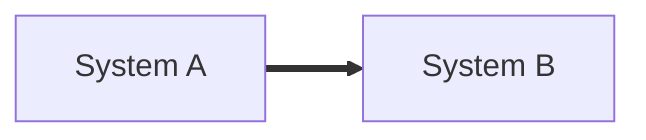
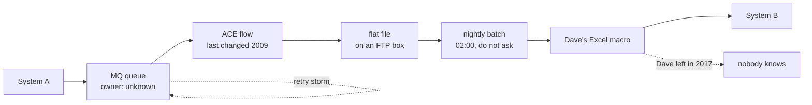

Engineering leader in enterprise integration — I take large IBM estates (ACE, MQ, MQFTE, DataStage, DataPower) and land them on Java, Spring Boot and Azure.

Thousands of interfaces and decades of middleware, moved without stopping the business — migration is an engineering problem, not a lift-and-shift.

Interested in agentic engineering: building CLI agents that do the discovery, the mapping and the grunt work so the humans do the judgement.

---

**"It's just one integration. Should take a sprint."**

**Two weeks later, in production:**

> This is why I do this for a living.

