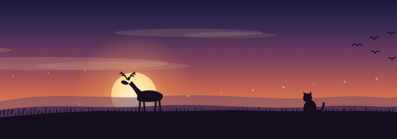

  

Engineering leader in enterprise integration.

Thousands of interfaces and decades of middleware, moved without stopping the business — migration is an engineering problem, not a lift-and-shift.

Interested in agentic engineering: building CLI agents that do the discovery, the mapping and the grunt work so the humans do the judgement.
